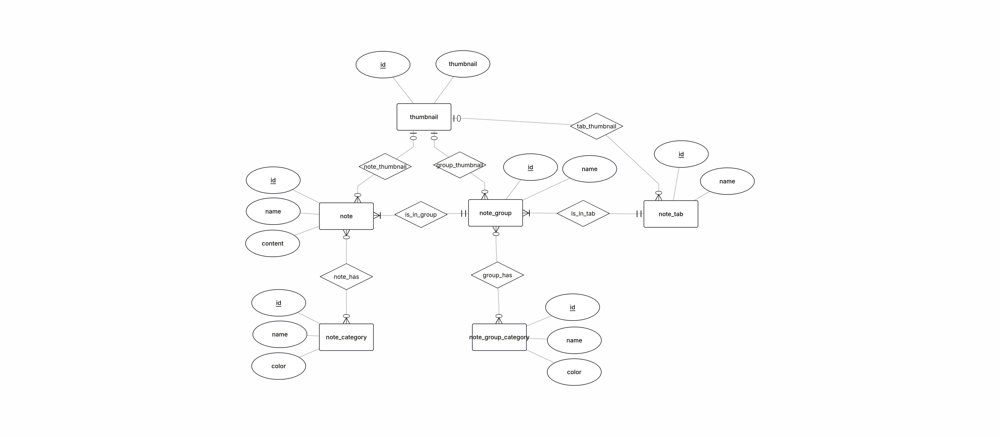
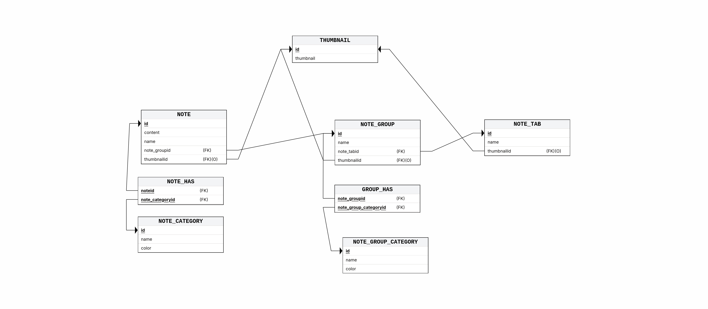
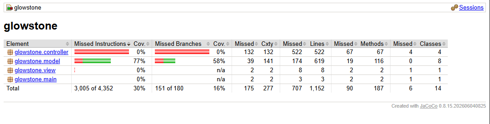

# GLOWSTONE 

## Overview & Objectives

Users need somewhere to put their ideas and keep track of their ongoing projects without the
hassle of using multiple different applications and tools for that. one application could solve the
issue by being a flexible tool for notetaking, as well as keeping a track of tasks while also being
visually appealing and customizable.

The main features of this program are note taking and assistance in organizing.

## Technologies

- Frontend: JavaFX 20.0.1
- Backend: Java JDK 17 or newer
- Database: MariaDB
- Other tools:
  - Maven 3.9.16
  - Docker
  - Jenkins

## Design & Development Methodology

We used the agile methodology.

We used MVC architecture for the project structure.



Frontend and backend were split to different branches in which the features were implemented.
After frontend and backend branches had their features implemented they were merged to a testing branch to connect the backend and frontend features.
After frontend and backend were connected this branch was tested before merging to main.

## Functional Testing



## Setup & Execution

### Docker image

requirements:
 - docker
 - X server (linux)
 - [Xming](https://sourceforge.net/projects/xming/) (windows)

#### 1. Setup MariaDB

Download the DB folder
[DB](./DB/)

or

Create a `docker-compose.yml` file containing the following text
```
services:

  db:
    image: mariadb
    restart: unless-stopped
    environment:
      MARIADB_ROOT_PASSWORD: example
    ports:
      - 3307:3306

  adminer:
    image: adminer
    restart: unless-stopped
    ports:
      - 8000:8080
```

Open a terminal in the same folder as the docker-compose.yml file

Start the Mariadb container with `docker compose up -d`

#### 2. Create database in MariaDB

Download the Glowstone Database
[GlowstoneV2.sql](./DB/GlowstoneV2.sql)

Open http://localhost:8000/

Sign in to MariaDB with username `root` and password `example`

Then import the database in
http://localhost:8000/?server=db&username=root&import=

by uploading `GlowstoneV2.sql` with the `File upload` option and pressing `Execute`

#### 3. Setup X server

##### Windows

Download and install [Xming](https://sourceforge.net/projects/xming/)

Start XLaunch

Use default setting in XLaunch

##### Linux

Download and install `xorg-xhost` if you have X server

or

Download and install `xorg-xwayland` and `xorg-xhost` if you have Wayland

Run `xhost +local:`

#### 4. Download docker image

`docker pull leoleerila/glowstone:v2`

#### 5. Start the docker image

##### Windows

Run
`docker run --network=host --rm -e DISPLAY=host.docker.internal:0 leoleerila/glowstone:v2`

##### Linux

Run
`docker run --network=host --rm -e DISPLAY=:1 leoleerila/glowstone:v2`